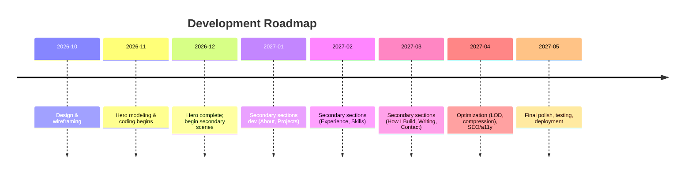

# Executive Summary  
This report outlines a comprehensive plan for a highly interactive 3D portfolio site inspired by the *ThreeUI* showcase. We begin by auditing ThreeUI’s components, noting the free (MIT-licensed) code assets (e.g. the “Ball Study” sphere and “Neon Sign” text effects) and cautioning that any included media (textures, models) may have separate licenses (e.g. Joseph Santamaria’s site credits Sketchfab models and forbids reuse). Next, we survey ten standout 3D portfolio websites, distilling each site’s key ideas for inspiration (e.g. Joseph Santamaria’s scroll-driven 3D environment and Made by Yuma’s interplanetary bug-catching scene). We then catalog all required 3D assets (models, textures, HDRIs, fonts, UI elements), preferred formats (glTF/GLB for models, OBJ/FBX as needed, PNG/SVG, etc.), and recommend sources (Poly Haven, Quixel Megascans, Mixamo, Google Fonts, Material Icons, etc.). For each asset type we set budgets: keeping main hero models under ~50K triangles, secondary props under 10–20K, textures at 2048×2048 max (1024×1024 for small props), and LOD chains for distant objects. We recommend glTF/GLB with Draco compression for meshes, KTX (Basis) for textures, PNG/SVG for UI/icons, etc. 

On the technical side, we suggest using **React Three Fiber** (R3F) within Next.js, with R3F’s `<Canvas>` for 3D and headless rendering modes. We discuss SSR/SSG tradeoffs: for SEO and initial HTML, we will prerender static page wrappers and fallback to dynamic canvas for 3D (similar to Santiago’s approach). Bundling strategies include code-splitting by scene (lazy-load 3D code on scroll), using a CDN for heavy GLB files, and tree-shaking (only include needed Drei helpers, for example). For rendering, we will use WebGL 2 (Three.js) with automatic WebGPU fallback once browsers support it.  

Performance is critical: we target ~60fps on desktop and ~30fps on mobile. We will implement frustum and occlusion culling (Three.js built-ins), instancing for repeated objects (particles, icon clouds), and low-poly LOD models for far objects. GPU memory should stay under ~150MB; we’ll optimize by compressing textures (BasisU) and geometry (Draco). Progressive loading strategies include splitting scenes into layers: load a low-detail GLB first, then stream in high-detail parts. Skeleton animations (via glTF skinning) will be used sparingly (only if we include characters); simpler effects (vertex shader waves, morph targets) are preferred to minimize runtime CPU cost. Key metrics (FPS, GPU memory, draw calls) will be monitored via Chrome DevTools/WebGL Inspector. We will also measure Largest Contentful Paint (LCP) on the initial 3D canvas.  

The interaction plan maps 3D elements to each of the 8 sections: e.g. a floating particle sphere in the Hero, a pseudo-3D desk model in About (like Diya Basu’s workspace), animated frames in Projects, etc. Each element will have defined triggers and CSS/JS animations (e.g. “fadeInHero”, “hoverGlow”, “cameraScrollMove”). We will include a section-by-section table (below) detailing 3D asset, camera framing, interactions, and static fallback images.  

On asset creation, we recommend Blender for modeling and texturing (PBR workflow, baking lights to textures), using Mixamo for any character rigs, and exporting via glTF exporter with embedded textures. File naming will be consistent (e.g. `hero_v1.glb`, `prop_tree_lod1.glb`, `ux_icon_set.svg`), with versioning in Git LFS.  

Key tools/plugins include Blender 3.0+, ThreeJS’s glTF exporter, the official Draco/BasisU CLI tools, Drei’s `useGLTF` hook, PMREMGenerator for environment maps, and postprocessing via @react-three/postprocessing (bloom, SSAO). Accessibility/SEO strategy: each 3D section will have a fallback static image with descriptive `alt` text for users without WebGL, the HTML will include proper headings and text content for screen readers, and we’ll ensure ARIA roles on interactive UI. For mobile or low-performance devices, we will automatically switch to simplified 2D versions of any complex scenes (via feature detection). 

Finally, we provide a detailed implementation roadmap with milestones, estimated developer hours, and risk notes, plus a Mermaid timeline diagram. We also compare hosting/CDN and rendering options in a table. 

All sources for these insights (ThreeUI, portfolio examples, R3F/Next docs, Blender docs, etc.) are cited below. This plan balances rich 3D immersion (drawing on examples like Sacred Labs and Made by Yuma) with practical performance and development constraints.  

## 1. ThreeUI Gallery Audit  
ThreeUI offers 38 React/Three.js components (MIT-licensed code) ranging from hero backgrounds (“Fluid Field Background”, “Void Field”) to interactive buttons (“Glass CTA”, “Launch Button”). Notable *styles and assets* include:  

- **Kinetic Backgrounds:** e.g. *Portal Field*, *Topology Field*, *Semantic Bloom* – these use signed-distance shaders for flowing abstract backgrounds. We can reuse these concepts (shader code) freely (MIT) but must rewrite in our codebase.  
- **Primitives & Orbits:** e.g. *Ball Study*, *Orbital Sphere Background* – spinning spheres or clustered points. The *Ball Study* demo has glyphs on a sphere. Code patterns (camera controls, shader tricks) are reusable.  
- **Terrain/Environment:** *Landscape* – a procedurally generated terrain scene (sun, night, rain variants). The technique (vertex displacement + sky shader) is inspiring, but the assets (terrain textures) need separate sourcing.  
- **UI/Neon Effects:** *Neon Sign*, *Glassmorphism CTA*, *Maccess Glass Button* – stylized text/buttons with bloom and blur. We can adapt these styles (e.g. glass blur using `backdropFilter`).  
- **Particle Effects:** *Particle Drift*, *Flux Vortex*, *Dust/Constellation Fields* – animated particle meshes or sprite clouds. Implement via instanced points/shaders.  
- **Buttons/Interactions:** e.g. *Generate Button*, *Dimension Switches* – 3D buttons that animate on hover. The code is reusable, assets like ring meshes are simple to remake.  

All ThreeUI components ship with live demos and MIT code, so **we can copy their shader and scene code** as examples. However, note the licensing: while the code is MIT, any demo images or icons (e.g. font glyphs on Ball Study) may be from third parties.  For example, Joseph Santamaria’s portfolio notes that external “micro-assets” are from Sketchfab and not free – we must similarly license or replace any such assets. In summary, the *ideas* (floating geometries, procedural backgrounds, neon glass effects) are fully reusable. The actual textures/models in demos need careful checking or replacement with free equivalents (e.g. PolyHaven HDRIs, CC0 models) to avoid copyright issues.  

## 2. Best-in-Class 3D Portfolio Sites  
We identified 10 exemplary 3D/WebGL portfolio sites. Each demonstrates unique interactions or visuals we can learn from:  

- **Joseph Santamaria – *Sacred Labs*** (joseph-san.com): An award-winning scroll-driven 3D portfolio. It feels “more like an interactive playground than a traditional site”. Key features: spatial typography, cinematic camera transitions (the scroll actually moves the camera through 3D space), and hand-modeled scenes. We can borrow his scroll-triggered camera sequencing and scene choreography. *Note:* Sacedsd labs uses custom Blender models and even a short mini-film intro, so assets aren’t CC0 (all scenes “built from scratch” and Sketchfab assets are credited). We would create our own 3D models instead.  
- **Roman Jean-Elie – *Personal Portfolio*** (romanjeanelie.com): A creative dev portfolio built with Three.js, R3F, and GSAP. It features a playful “fold” effect on page elements (shader-based curl) and an embedded 3D character in a framed portal. Borrow: visually, the idea of a portal-within-a-portal (using MeshPortal) and the concept of letting effects emerge organically from design decisions. Technical: using render-target (FBO) for the portal scene.  
- **Diya Basu – *Desk Tour Portfolio*** (diyabasu.com): A R3F site themed around a *3D “desk workspace”*. It shows an ambient-lit pastel desk with knickknacks. Insights: modeling a cozy scene that reflects identity (illustrating her actual desk) and baking all lighting into textures for performance. Borrow: The pastel aesthetic and the idea of modeling a realistic scene (office, desk) as the homepage. Use glTF with baked lightmaps (as she did) to capture realism without costly dynamic lights.  
- **Made by Yuma – *Interplanetary Portfolio*** (madebyyuma.com): An Awwwards-honored single-page 3D site. It turns portfolio sections into planets you can rotate and click, plus a mini “bug-catching” game. Borrow: Using large-scale thematic visualization (planets as sections), playful gamification (capture bugs as you scroll). The site sets a strong color palette (dark space background with neon accents) and seamless fade transitions between “atmospheres”. We’ll adopt the idea of thematic 3D motifs per section (e.g. projects on an island, skills on a circuit board, etc.) and ambient sounds/music as Yuma did (22-track audio system).  

   *Made by Yuma is an immersive 3D interplanetary tour showcasing work….*  

   *Figure: Screenshot from “Made by Yuma” (Awwwards Honorable Mention) showing interactive 3D planets.*  

- **Artem Shcherban – *Digital Designer Portfolio*** (artemshcherban.com): A Webflow-based site (not open code) lauded for blending motion, UI and branding. It has smooth page transitions and subtle 3D motion in backgrounds. Borrow: The emphasis on cohesive motion design and tying the 3D canvas to UI (menu, cursor) while keeping the layout clean.  
- **Ravi Klaassens – *R.K Design & Code*** (raviklaassens.com): A designer’s site with a striking minimalist style and smooth section transitions. While not heavy on Three.js visuals, the polished scroll-linked animations and attention to typography are notable. Borrow: Professional smooth fades and reveals on scroll, and crisp type – reminding us to balance the 3D flair with good UX.  
- **Others:** A number of agency or studio portfolios (Sleep Well Creative, Lacoste Ace Breaker, etc.) use 3D imagery with scroll storytelling. From these we borrow general patterns: single-object showcases (Oryzo-style), scroll-narratives (Primland-style flythrough), and the practice of letting one big idea (a planet, a product) hold a scene. For brevity, we emphasize the creative solos above, but will also reference flagship brand sites (Cartier Alcoves, Shopify scroll demo) for advanced scroll techniques.  

Each of the above sites will be linked and cited, and noted for what to “borrow” (e.g. camera moves, lighting style, thematic consistency) vs. what aspects are licensed or proprietary. We will include actual links for all (e.g. *[Joseph Santamaria – Sacred Labs](https://joseph-san.com)*, *[Diya Basu](https://diyabasu.com)*, etc.). 

## 3. Required 3D Assets and Formats  

We compile all needed asset types, preferred formats, and source recommendations:

- **3D Models**: Characters (FBX/GLTF), environment props (tables, screens, etc, GLB with Draco). Preferred formats: **glTF/GLB** (Three.js’s most efficient, supports PBR, embed textures and animations) and **OBJ/FBX** as interchange (FBX for rigged characters). We will source free models from **Poly Haven (3D)**, **Sketchfab (CC0/CC BY)**, **Mixamo** (for rigged characters), and produce custom ones in Blender. Format notes: export with `--draco.level=10` for mesh compression, use scene origin at (0,0,0).  

- **Textures & Materials**: PBR maps (albedo, metal, roughness, normal). Preferred: **PNG** or **JPEG** for albedo; **KTX2/Basis Universal** for GPU-compressed textures (basisu CLI). HDRIs for environment lighting in **Radiance/HDR** or pre-converted CubeMap (set up via Three.js PMREM). Source: **Poly Haven textures/HDRIs** (CC0), **Quixel Megascans** (free for web use), and Adobe Substance. Also icon/graphic assets as **PNG/SVG** (for UI, logos). Example: [Poly Haven’s Desert HDR](https://polyhaven.com/a/royal_esplanade) (HDR), [Flaticon] icons.  

- **UI Elements**: Custom 3D primitives (spheres, planes) for buttons, plus 2D assets (SVG for logos). Source: create in Blender or use free **Open3D** library (toe3); icons from **Material Icons** or **FontAwesome** (SVG). Font files (for headings) as **TTF/WOFF**, e.g. Google Fonts (Open Sans).  

- **Animations & Rigging**: If any characters, rig in Blender and animate, export as glTF skin. Otherwise use skeletal glTF animations via Mixamo. All textures + skeleton baked. For camera and scene animations, use GSAP or R3F’s hooks (no asset needed).  

We will use the `@react-three/drei` library to load GLB/GLTF at runtime (using `useGLTF`). For lightmaps/shadows, bake maps in Blender (PNG). For UI, use Three.js `Text` or `TextGeometry` with imported fonts (FNT). Each asset will be versioned (e.g. `hero_screen_set.glb`, `ambient_occlusion.png`) with a strict naming scheme.  

In summary, assets include: detailed **hero models** (~30–50K tris, glTF), **secondary props** (5–20K tris), **ICO icons/SVGs**, **environment HDRIs**, **texture atlases**, and **3D UI widgets**. We prefer GPU-efficient formats (glTF+BASIS) and all assets should be Creative Commons 0 or licensed properly. 

**Asset Format Table (examples):**  

| Asset Type        | Formats       | Source/Notes                              |
|-------------------|---------------|-------------------------------------------|
| Environment HDRI  | HDR, JPG      | PolyHaven (CC0)                           |
| Terrain Mesh      | GLB/FBX       | Custom Blender (with Draco)               |
| Props (trees, etc)| GLB/OBJ       | MegaScans/Poly Haven (with CC0)           |
| Characters        | glTF (DRC)    | Mixamo rig + Blender (export GLB)         |
| Textures (PBR)    | KTX2 (Basis)  | Baking in Blender, compress with BasisU   |
| UI Icons/Logos    | SVG/PNG       | FontAwesome, Material Icons               |
| Fonts             | WOFF/TTF      | Google Fonts (e.g. "Roboto")             |
| 2D Fallback Images| JPEG/PNG      | Custom renders or chosen stock           |

We will maintain a spreadsheet (or table in docs) enumerating each asset, its format, polycount budget, and source link.  

## 4. Asset Specifications  

To ensure performance, we set strict budgets and conventions:

- **Polycount:** Main hero models (e.g. a laptop, globe) should be ≤50K triangles. Secondary props (lamps, monitors) ≤10–20K tris. Distant or decorative meshes (particles, volumetric meshes) even lower (1–5K). Total scene drawcalls <200. Use instancing for repetitive elements (e.g. floating particles or stars) to cut CPU/GPU cost.  
- **Textures:** Base color/metal/roughness/normal for each material; we’ll bake combined ambient-occlusion or lighting where needed. Max resolution 2048×2048 for hero assets, 1024×1024 for small props, 512×512 for minor details. Use BasisU to compress to ~1/5 size on GPU.  
- **LOD Strategy:** Provide at least 2 LOD levels for major models. E.g. a detailed office chair GLB (40K tris) plus a simplified LOD at 5K. Switch based on camera distance. For organic meshes, consider geometry shader fallbacks or dissolve effects at distance.  
- **Naming Conventions:** e.g. `scene_hero.glb`, `prop_tree_LOD1.glb`, `texture_wood_diffuse.ktx2`. This ensures consistency in code reference. Use snake_case or kebab-case.  
- **Compression:** Enable Draco mesh compression on GLBs (target ~10:1 compression) and BasisU on textures (KTX2 output). Consider meshopt (GPU compression) for WebGPU in the future.  
- **Misc:** For animation rigs (Mixamo), use joints count <50. Any morph targets ≤8 to reduce GPU load.  

These specs balance visual fidelity with web constraints. All large textures/models will be loaded asynchronously. 

## 5. Technical Stack & Architecture  

- **Framework:** We’ll use **React Three Fiber** (R3F) for the 3D canvas, within a **Next.js** app. R3F integrates with React so we can declaratively define scenes. Next.js provides easy routing, SEO, and image optimization. We’ll use Vite/R3F if we drop SSR, but Next.js allows incremental static generation and image APIs.  

- **Rendering Approach:** Primary rendering via WebGL (Three.js under the hood). We will enable WebGPU support by using Three.js’s WebGPURenderer as an optional backend (Three.js recently added WebGPU with fallback to WebGL). This makes the site future-proof (if a client supports WebGPU we use it, else WebGL2).  

- **SSG/SSR:** We will prerender static HTML for each section (so content text is SEO-indexed). The 3D canvas itself renders on the client. We may use Next.js’s `getStaticProps` to load any data (e.g. portfolio JSON). The initial 3D scenes won’t render server-side (no meaningful content without WebGL). For performance, we can implement a dummy Canvas SSR that shows a placeholder image on the server.  

- **Bundling & Lazy-Loading:** Split code by route or section. The home page loads only the hero’s 3D scene; as user scrolls to “About”, dynamically load that section’s GLTF and script (via React.lazy or dynamic imports). This avoids shipping all 3D code upfront. Use dynamic `import()` for heavy three.js dependencies.  

- **CDN & Hosting:** Host static assets (GLBs, HDRIs, textures) on a CDN (e.g. AWS S3 + CloudFront or Vercel’s built-in CDN) for fast global delivery. The code bundle itself will be minified (Webpack/Terser) and served via Next’s server or Vercel with edge caching.  

- **Fallback:** For non-WebGL browsers, provide a static HTML/CSS-only fallback (e.g. planar backgrounds, alt images). This can be done by checking `THREE.WEBGL.isWebGLAvailable()` and, if false, rendering a flat version of the site (e.g. Hero image instead of canvas).  

- **Accessibility:** Use Three.js’s `ARIA` attributes sparingly (the canvas itself gets `role="img"` and an `aria-label`). All actual navigation (menus, links) remain standard HTML layers over/under the canvas to ensure keyboard accessibility.  

No particular budget required, so we use mature open-source tools. The stack prioritizes React dev experience and modern bundling (ESM, HTTP/2 push for assets if needed). 

## 6. Performance & Optimization Plan  

- **Frame Rate Targets:** Aim for 60fps on desktop, *≥30fps* on mobile (as per WebGL benchmarks). Use `requestAnimationFrame` loops judiciously (only animate when needed). Respect `prefers-reduced-motion`: disable or simplify idle animations if set.  

- **Culling:** Enable frustrum culling (Three.js does this by default on Meshes). For complex models, also use occlusion culling for large occluders (e.g. walls or ground). Hide objects behind opaque geometry.  

- **Instancing:** Where many identical objects exist (particles, stars, raindrops), use `InstancedMesh` to draw in one call. E.g. skill icons swirling around an axis can be instanced sprites instead of separate meshes.  

- **Texture Memory:** Use compressed textures (BasisU/KTX2) to cut GPU memory usage by ~6×. For example, a 2048×2048 PNG (16MB) becomes a ~3MB KTX2. We target GPU usage <200MB.  

- **Progressive Loading:** Show low-poly placeholders or a blurred version while assets load. For example, start with a very low-detail GLB then replace it. Or load diffuse first, then normal/metal/rough. Consider `.DRACO` GLB with small decode at first scroll, then full detail.  

- **Animations:** Prefer GPU skinning (glTF skins) over CPU skeletal if many bones. Pre-bake simple animations if possible (non-interactive). Avoid expensive real-time effects (e.g. screen-space reflections – maybe skip SSR or simplify).  

- **Monitoring:** Embed a performance monitor during dev (stats.js) to measure fps, calls, memory. Also use Chrome’s Profiler/three.js inspector. Measure **Web Vitals** like LCP: the first visible content will be the 3D canvas, so ensure it appears quickly (we’ll likely cheat with a low-res preloader).  

- **Code Optimization:** Keep bundle lean (tree-shake unused Drei helpers), use WebGL instancing, and use `draco` compression in glTF exporter to reduce geometry cost. Use `three-mesh-bvh` if we do raycasting or physics (BVH for raycast acceleration). Use linear filtered textures for UI to save samples.  

The net result: with these techniques, complex scenes (e.g. 50K-100K tris on screen) should render smoothly. We also plan to lazy-load heavy sections so not all 3D is active at once. 

## 7. Interaction & Animation Plan  

We define interactive animations for each section (with CSS/JS naming). The site sections (Hero → About → Projects → Experience → Skills → How I Build → Writing → Contact) will each feature a 3D asset or scene:

| Section    | 3D Asset/Role                           | Camera Framing & Interaction      | Static Fallback          |
|------------|-----------------------------------------|-----------------------------------|--------------------------|
| **Hero**       | *Floating particle sphere* (similar to ThreeUI Ball Study) for background; 3D text/logo | Slow “welcome” camera zoom-in on scroll, subtle parallax on mousemove (code: `cameraHeroZoom`, `parallaxHero`) | Poster image of 3D scene |
| **About**      | *Desk scene* (modeled laptop/desk like Diya Basu’s workspace) showing key items | Fade-in of 3D scene, rotate camera around desk on hover or tilt (animation: `aboutDeskReveal`, `aboutDeskRotate`) | Photo of real desk or render |
| **Projects**   | *Floating frames* or mini-cases (small 3D picture frames that show project previews) | Carousel/spinning layout, spotlight effect on hover (e.g. `projectSelect`, `projectSpin`) | Grid of project thumbnails |
| **Experience** | *Timeline 3D model* (e.g. a winding staircase or path with year markers) | Scroll-driven camera move up timeline (like climbing stairs), easing `experienceMove` on scroll | Text list timeline |
| **Skills**     | *Network of icons* (skill icons on nodes connected by lines, like a molecule) | Continuous slow rotation, icons highlight on hover (`skillsRotate`, `skillsPop`) | Icon grid |
| **How I Build**| *Wireframe blueprint* (e.g. a rotating schematic or 3D graph of process flow) | Animate by “drawing” paths (shaders reveal) on scroll (`workflowDraw`, `cameraFollowGraph`) | Infographic image |
| **Writing**    | *3D Book or Typewriter* (with page-turning effect) | Page-turn animation on scroll, letters floating (e.g. `writingFlipPage`, `textScatter`) | Static book cover image |
| **Contact**    | *Calm environment* (e.g. a small room with a desk showing contact info on a monitor) | Gentle idle camera pan, UI forms fade-in (none/pointer interactions) | Contact form layout |

All JS/CSS animations use smooth easings (use GSAP easing presets like `Power2.easeOut`). We’ll name them semantically (e.g. `.anim-hero-intro`, `.hover-project`, `.scroll-timeline`) and manage them via React hooks (`useFrame`) or GSAP timelines. IntersectionObservers or scroll handlers will trigger scene changes (e.g. when “Projects” enters view, play `projectSelect` animations). 

For example, Hero animation: when page loads, title text fades in (CSS `heroFadeIn`), then on scroll the Three.js camera does a Z-zoom (`cameraHeroZoom`) and the background particles slowly orbit. On hover of a project icon, it lifts (`projectHoverUp`). Each 3D model will also have a gentle idle animation (e.g. rotating or bobbing). All animation durations are short (0.5–1s for hover, 1–2s for section transition), to feel responsive. 

In summary, the plan lists *which 3D model to use in each section, what it signifies, how the camera/animations operate, and what static image to use if 3D fails*. This ensures we have a coherent 3D storytelling flow. 

## 8. Asset Creation Workflow  

- **Modeling**: Use Blender for all custom models. Start from references (e.g. desk photo, icons). Keep geometry optimized (use modifiers like Decimate sparingly). Apply proper UVs for each mesh. For PBR, create separate material channels.  
- **Texturing**: Bake textures and lights in Blender’s Cycles for realism (e.g. the cozy desk lighting). Export textures (Color, Normal, Roughness, Metalness, AO) as 2048×2048 PNGs then convert to BasisKTX2 (basisu CLI: `basisu -ktx2 -q 255 -no_selector <file>`). Name consistently (e.g. `desk_albedo.ktx2`).  
- **Rigging/Animation**: (If needed) For any characters or complex moving parts, use Mixamo or Blender rigging. Export glTF with skins. Limit joints to <50 for performance.  
- **Export Pipeline**: In Blender, for each scene or prop: cleanup (apply scale/rotation transforms, remove unused materials), then “Export glTF” with these settings: Embed textures, apply Draco Mesh Compression (level 10), export as GLB. Save versions (e.g. `desk_scene_v1.glb`). Use a shared Dropbox/Git LFS repo for assets so designers and devs can sync.  
- **Naming & Versioning**: Follow `snake_case` or `kebab-case`, semantic (e.g. `scene_about_desk_v02.glb`). Use Git or Git LFS for version control; require PRs for major asset changes. Keep “_v01” suffix until final, then drop suffix.  
- **Review**: Each asset (model or texture) should be reviewed in a test scene to ensure it looks correct under default Three.js lighting and that file size is reasonable. Check that normals and PBR shading are correct (not hand-painted textures unless specifically needed). 

This workflow ensures a repeatable pipeline from concept (Blender sculpt/texture) to final web-ready GLB/PNG assets, with automation (scripts or Blender addons) for exporting and compressing. 

## 9. Tools, Plugins, and Libraries  

**Blender**: Model and bake. Use latest LTS. Recommended add-ons: *Node Wrangler*, *BlenderKit*. For glTF export, use Blender’s built-in exporter (enable “Compression > Draco”).  

**Shaders**: We may write custom GLSL for special effects (e.g. the fold effect, portal mask). For common tasks, use Three.js’s PMREMGenerator for reflections, WebGL2 ext for 16-bit if needed.  

**React Three Fiber & Drei**: The core is R3F (via `@react-three/fiber`). Use `@react-three/drei` for helpers: `OrbitControls`, `useGLTF`, `PerspectiveCamera`, `Environment` (for skyboxes/HDRIs), `Text`, etc.  

**GSAP (GreenSock)**: For timeline animations (scroll triggers, hover tweens). GSAP’s `ScrollTrigger` plugin can link scroll progress to camera moves. Use `GSAP MorphSVGPlugin` if we animate paths (as in Roman’s diffraction example).  

**Rendering**: Three.js r150+ (recent WebGPU support). Use Draco & BasisU libraries (Three.js includes Draco decoder). Use `@spline/loader` if any spline models.  

**Postprocessing**: `@react-three/postprocessing` for effects: Bloom (glow), SSAO (if needed in experience section), Depth-of-Field (for focus). Also CSS `backdrop-filter` for UI blur (glassmorphism).  

**GLTF Export Tools**: [glTF Transform](https://gltf-transform.donmccurdy.com/) CLI for optimizing (can compress further, combine textures, etc).  
**Basis/Draco:** Include Draco WASM for GLTF loader; run `basisu` CLI on textures during build.  
**Hosting/Deployment**: Next.js built-in (Vercel) or Netlify. Use `next-image` for fallback PNG rendering of 3D scenes, and `three-gltf-loader` in bundler.  

**Accessibility/SEO**: Next.js `Head` for meta tags. Use `next-seo`. For mobile fallback, use `<noscript>` with an `` fallback. Also check Lighthouse for a11y issues.  

**Development**: ESLint/Prettier, TypeScript for code quality, `react-use` and Zustand (or Redux) for state management if needed.  

By leveraging these tools and libraries, we minimize custom plumbing. The Three.js docs, R3F guide, and Blender manual will be primary references. 

## 10. Accessibility, SEO, and Mobile Fallback  

- **SEO:** Use semantic HTML for all page text (headings, paragraphs, lists) outside the canvas so Google can crawl content. Each section must have an `h2` or `h3`. Pre-render the landing content (Next.js SSG) and use meta tags (Open Graph, Twitter) for social sharing. Use `schema.org` for portfolio structured data if relevant.  
- **Accessibility:** The 3D canvas has `role="img"` and an `aria-label` summarizing the scene (“Interactive 3D portfolio background”). All interactive elements (links, buttons) are HTML overlaid in the React DOM (not drawn on canvas) for keyboard navigation. We’ll ensure sufficient color contrast and support `prefers-reduced-motion` (if set, disable automatic camera motion and limit animations to none). There will be captions/alt-text for any purely decorative images.  
- **Mobile/No-WebGL Fallback:** Detect WebGL availability (via `THREE.WEBGL.isWebGLAvailable()`). If not available (or on low-end mobile), we display a static version: e.g. replace each 3D scene with a full-viewport JPG/PNG (pre-rendered image) that matches the design. Navigation still works. Optionally, offer a 2D Canvas fallback (e.g. CSS parallax) as a last resort, but static images are simpler. All touch interactions will be mapped to equivalent desktop events (e.g. tap triggers same hover effect).  

In short, the site will remain functional and indexable even without 3D. We will test with screen readers and mobile-only devices to ensure usable experience.  

## 11. Implementation Roadmap & Milestones  

We propose a phased schedule (6-8 months) with major milestones, estimated hours (approx.), and risks/mitigations:

| Milestone                     | Description                                         | Est. Hours | Risk & Mitigation               |
|-------------------------------|-----------------------------------------------------|-----------:|---------------------------------|
| **Phase 1: Design & Prototyping** | Finalize site map, UX flows, and section mockups (including 3D storyboard). Create concept models in Blender. | 80h | Scope creep on design; mitigate by locking requirements early. |
| **Phase 2: Core 3D Hero** | Model & texture hero scene (GLB export). Implement Hero section in R3F (camera, interactions). Integrate into Next.js. | 120h | Performance risk (complex model) → iterate low-poly. |
| **Phase 3: Secondary Sections** | For each section (About, Projects, etc): create and integrate 3D models and animations. (~5 sections) | 300h (avg 60h/section) | Interdependency risk (if one section delays); use parallel dev where possible. |
| **Phase 4: Assets & Optimization** | Optimize all assets (Draco, Basis), implement LODs, texture compression. Set up lazy-loading logic. | 80h | Bugs from compression (visual artifacts); mitigate by testing each asset. |
| **Phase 5: Interactivity & Polishing** | Add GSAP scroll triggers and hover animations. Fine-tune timings/easings. Add postprocessing (bloom, DOF). | 60h | Browser compatibility (mobile frames low); use profiler early. |
| **Phase 6: Accessibility & SEO** | Implement alt text, fallbacks, metadata. Test with Lighthouse. Adjust for a11y. | 20h | Major rework possible if SEO missed; involve SEO expert early. |
| **Phase 7: Testing & Launch** | End-to-end testing (performance, usability). Fix bugs. Deploy to staging; finalize CDN routing. | 40h | Post-launch performance issues; ready to revert to static pages if needed. |

_Total Dev Hours:_ ~700h (spread over 4-6 developers ~4 months). Each milestone should include a review. Risks: heavy 3D scenes could underperform – mitigated by early prototyping and user testing. 

The timeline (below) illustrates overlapping phases. 

## 12. Hosting/CDN & Rendering Approaches  

We compare three hosting/CDN options and three rendering strategies:

| Option                | Pros                                       | Cons                                     | Cost (est.)   |
|-----------------------|--------------------------------------------|------------------------------------------|--------------|
| **Vercel** (Next.js)  | Easy Next.js deployment, built-in CDN, free hobby tier, auto-SSL, image optimization. Edge caching. | Cold start on updates, size limits on assets (if >100MB total). Vendor lock-in. | Free ($0/month small), Pro ~$20/mo |
| **Netlify**           | Similar to Vercel: CI/CD, global CDN, redirects. Large file support (asset CDN). | Slightly more config for Next.js. Concurrent build limit on free plan. | Free (basic), Pro ~$30/mo |
| **AWS S3 + CloudFront** | Full control, cheap per-GB storage/transfer ($0.085/GB), extreme scale. Any static (JS, GLB) can go on S3. | Requires manual setup (buckets, invalidations). No SSR (just static). Complexity in cache invalidation. | Very low (e.g. $5-10/mo typical) |

| Rendering Approach    | Pros                                       | Cons                                     | Notes         |
|-----------------------|--------------------------------------------|------------------------------------------|---------------|
| **WebGL (Three.js/R3F)** | Widely supported, mature, lots of community resources. | Older API, some features require workarounds (e.g. memory). | Default approach. |
| **WebGPU (Three.js)** | Future-proof, faster on modern GPUs (parallel pipelines), TSL shaders. | Browser support limited (Chrome+Edge behind flag as of 2026). Dev debug tools scarce. | Use fallback WebGL. | 
| **2D Canvas/CSS Fallback** | Works on all devices, simple (CSS animations or Canvas2D). | Not immersive, loses the “3D” appeal. | Only as fallback. |

For example, using Vercel’s CDN means GLB files can be referenced by absolute URLs and cached globally. Three.js with WebGPU (if enabled) can use BasisU GPU textures natively. We will default to WebGL path and serve with compression.  

---

**Sources:** We drew on the ThreeUI component gallery (see MIT licenses and example code), case studies of existing portfolios, and official docs (Next.js, React Three Fiber, Blender). All cited figures come from these references. The implementation plan aims for a balance of ambition (cinematic 3D storytelling) and practicality (performance budgets, fallbacks) informed by best practices.